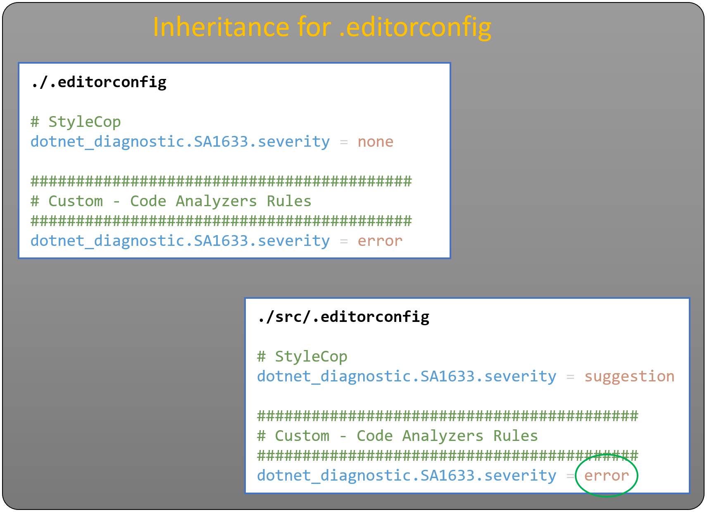

# ATC-NET Coding Rules and Guidelines

[ATC Analyzers Rules decisions overview](/documentation/CodeAnalyzersRules/README.md)

## What is it?

This github repository contains coding rules which are defined by the ATC core team for use in various code projects. It is a collection of code analyzers with all rules `treated as errors` by default - for `release build`.

When creating a new project, it will be a good start to download files from the [distribution](https://github.com/atc-net/atc-coding-rules/tree/main/distribution) folder as a starting point for a solution.

The main focus for the ATC core team is Visual Studio, Visual Studio Code and .NET/C#.

## Incentative

A team can use the same set of code rules for all projects.

Extensive code style settings for C# have been defined that require the latest C# features to be used.

All .NET naming conventions are consistent with the .NET Framework Design Guideline's [Naming Guidelines](https://docs.microsoft.com/en-us/dotnet/standard/design-guidelines/naming-guidelines).

## Process around changes

When a rule is found annoying and someone wants to deactivate it, this must follow a standard procedure. Firstly, argumentation must be in place as to why the rule should be disabled. Once this argumentation is in place, a session with the ATC core team can be held, where a decision will be made and afterwards executed and documented.

**This means that NO rules must be deactivated by a single person and must first be documented so that everyone later can refer to this!**

## Usage

Take a copy of the [distribution](https://github.com/atc-net/atc-coding-rules/tree/main/distribution) folder and drop it into the root of a project. Once this is done, when opening a file in Visual Studio, the .editorconfig file settings will automatically be used to help format the document and also raise warnings if the code style and formatting does not conform to the rules.

For Visual Studio Code, install the [EditorConfig for VS Code](https://marketplace.visualstudio.com/items?itemName=EditorConfig.EditorConfig) extension to gain .editorconfig support.

## Q & A

### Q: How to get started

One way is to use the sample provided here [atc-coding-rules-updater](https://github.com/atc-net/atc-coding-rules-updater/blob/main/sample/README.md).

Another way is to just download the files manually from the distribution folder.

Note: First time the script is run, it will create folders like `src`, `test`, `sample` and dump relevant files into each folder.

Directory descriptions:

* `src` - folder for source code
* `test` -  folder for test code
* `sample` - folder for sample/demo applications

If the folder `sample` is not relevant - simply delete this folder, and it will not be recreated when the script is run again.

### Q: I see a rule is suppressed - why?

1) If the rule is suppressed in code by a `SuppressMessage` attribute, hopefully the `Justification` description should clarify it.
2) If the rule is suppressed in the `.editorconfig` and it is not defined under a _custom section_ then the rule must be found under [documentation for rules suppression overview](/documentation/CodeAnalyzersRules/README.md)
3) I can't see the rule defined as described in bullet 1 or 2 - Then the rule is **INVALID**  - use `git blame` and get the code fixed with the person/team or/and follow up on the process for code quality - e.g. improve the PullRequest-Review process.

### Q: I have a suggestion to a rule I dont like

If you have a rule you don't like, please feel free to start a suggestion proceess.

Create a new [issue](https://github.com/atc-net/atc-coding-rules/issues/new/choose) based on the `Rule suppression suggestion`

Read more on this in the [rule suppression process](/documentation/CodeAnalyzersRules/rule-suppress-process.md).

### Q: What is a .editorconfig file?

EditorConfig helps developers define and maintain consistent coding styles between different editors and IDEs. The EditorConfig project consists of a file format for defining coding styles and a collection of text editor plugins that enable editors to read the file format and adhere to defined styles. EditorConfig files are easily readable and they work nicely with version control systems. Find out more at:
* [editorconfig.org](http://editorconfig.org/)
* [Visual Studio Docs - editor](https://docs.microsoft.com/en-us/visualstudio/ide/create-portable-custom-editor-options?view=vs-2019)
* [Visual Studio Docs - code style](https://docs.microsoft.com/en-us/visualstudio/ide/editorconfig-code-style-settings-reference).

### Q: The use of severity levels

For atc-coding-rules the default severity setting is: `dotnet_analyzer_diagnostic.severity = error`
and **`Treat Warnings As Errors`** is set for **`Build-Target = Release`**

This means that atc-coding-rules only use the following severity:
* `error`
* `suggestion` (`Info` in [Visual Studio - Error List Window](https://docs.microsoft.com/en-us/visualstudio/ide/reference/error-list-window?view=vs-2019))
* `none`

Read about severity-level:
* [configuration-options => severity-level](https://docs.microsoft.com/da-dk/dotnet/fundamentals/code-analysis/configuration-options#severity-level)
* [configure-severity-levels meaning for Visual Studio](https://docs.microsoft.com/en-us/visualstudio/code-quality/use-roslyn-analyzers?view=vs-2019#configure-severity-levels)

### Q: How does inheritance work for project properties

Imagine that we want to set the `LangVersion` property. To do this we can set it directly in the `.csproj` file or it can be set in a `Directory.Build.props` file - or in both files. The `MSBuild` or `dotnet build` commands both use the file hierarchy of `Directory.Build.props` and `.csproj` to read the value of the `LangVersion` property. Last definition wins.

Example of a hierarcy:

The `LangVersion` property value will be read as: ~~7.0~~ => ~~8.0~~ => **9.0**

### Q: How does inheritance work for severity level for a rule

Imagine the we want to set the severity level for a rule `SA1633`. To do this we can set it in the `.editorconfig` file and it can be set multiples times. An editor like `Visual Studio` or `VS Code` uses the file hierarchy of `.editorconfig` to read the **key/value** pair (`dotnet_diagnostic.SA1633.severity`). The last definition of the **key/value** pair wins.

Example of a hierarchy:

The `dotnet_diagnostic.SA1633.severity` value will be read as: ~~none~~ => ~~error~~ => ~~suggestion~~ => **error**
